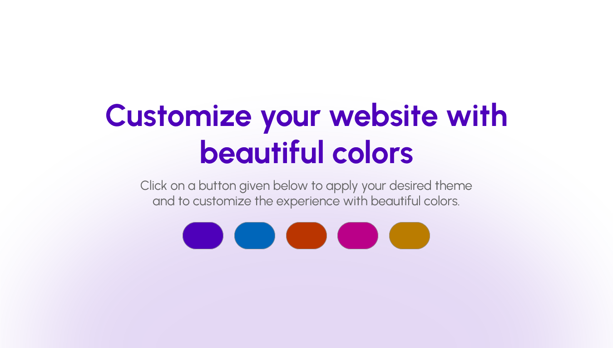

# 🎨 Dynamic Theme Picker

## ✨ Project Overview

A lightweight front-end component built with HTML, CSS and JavaScript that lets users instantly switch your website’s primary color theme by clicking a color swatch. It emphasizes performance, clean code, and easy integration into modern web apps.

---

## 🖼️ Project Preview



---

## 🚀 Core Features

| Feature | Description | Tech Implementation |
| :--- | :--- | :--- |
| **Instant Theme Switching** | Changes the website's headline color and ambient background gradient with a single click. | **JavaScript** (DOM manipulation) |
| **Visual Feedback (Hover)** | Buttons show a slight scale and border change on hover, improving interactivity. | **CSS (`:hover`, `transform`, `border`)** |
| **Smooth Transitions** | All color changes are animated using CSS transitions, ensuring a professional and non-jarring user experience. | **CSS (`transition` property)** |

---

## 🛠️ Tech Stack

* **HTML5:** Semantic structure for the component and its controls.
* **CSS3:** Styling, responsive design, and animations (transitions).
* **JavaScript:** Core logic for event handling, theme application, and persistence.
* **Google Fonts:** Used for a high-quality, modern typography.

---

## ⚙️ Installation and Usage

1.  **Clone the repository:**
    ```bash
    git clone https://github.com/arcchetan/Dynamic-theme-picker
    ```
2.  **Navigate to the project directory:**
    ```bash
    cd counter-app
    ```
3.  **Open the file:**
    Simply open the `index.html` file in your preferred web browser.

    > **Tip:** Alternatively, you can use a Live Server extension (if using VS Code) to run the project.

---


## 🤝 Contributing

Contributions, issues, and feature requests are welcome! Feel free to open a pull request or submit an issue if you find any bugs or have suggestions for new features.

---

## 📄 License

This project is licensed under the MIT License – see the `LICENSE.md` file for details.

---
**Developed by [Chetan Sharma]**